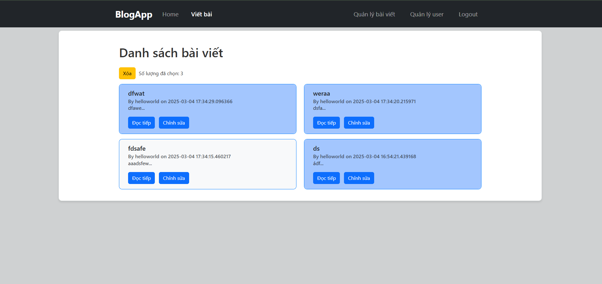

# Release Version 4 - Quản lý Bài Viết / Nhiệm Vụ

## Tính năng mới

Trong phiên bản này, chúng tôi đã bổ sung khả năng quản lý bài viết (posts) hoặc nhiệm vụ (tasks) của người dùng. Người dùng hiện có thể chọn nhiều bài viết/nhiệm vụ cùng lúc để thực hiện thao tác xóa hàng loạt.

## Các thay đổi chính

### 1. Giao diện quản lý bài viết/nhiệm vụ:

 - Bổ sung checkbox để chọn nhiều bài viết/nhiệm vụ.

 - Thêm nút "Xóa đã chọn" để xóa tất cả mục đã chọn.

### 2. Xử lý logic trên backend:

 - Nhận danh sách ID bài viết/nhiệm vụ từ frontend.

 - Xóa nhiều mục cùng lúc trong database bằng truy vấn SQL.

### 3. Cải thiện UI/UX:

 - Hiển thị thông báo xác nhận trước khi xóa.

 - Cập nhật lại danh sách sau khi xóa thành công.

### Hướng dẫn sử dụng

 - Vào trang quản lý bài viết.

 - Chọn các bài viết cần xóa (checkbox ẩn nên chỉ cần chọn thủ công).

 - Nhấn nút "Xóa" .

 - Danh sách sẽ tự động cập nhật.

Ảnh màn hình

Ghi chú

Chỉ chủ sở hữu bài viết/nhiệm vụ mới có thể thực hiện thao tác này.

Tính năng này giúp người dùng quản lý nội dung hiệu quả hơn.