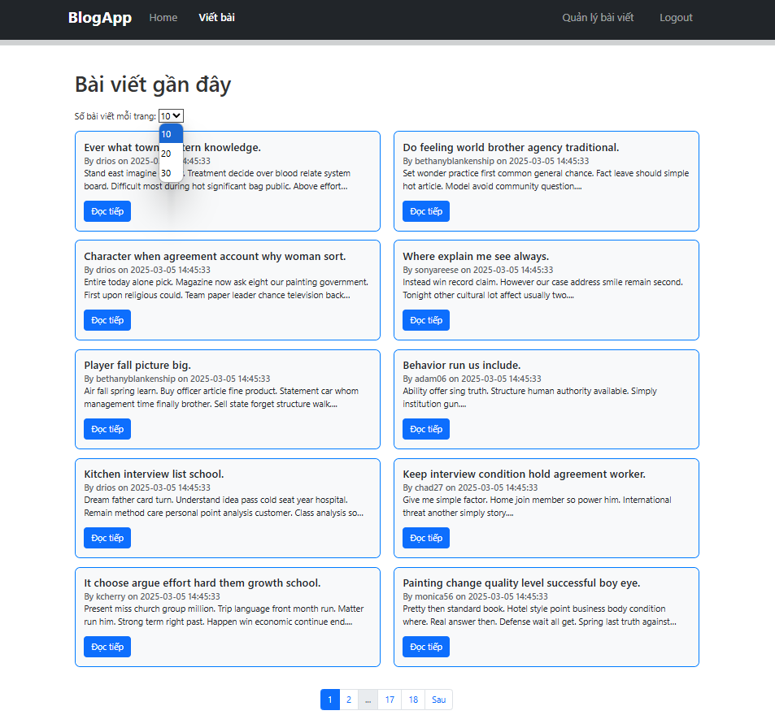

# Release Version 5 - Phân trang (Pagination)

## Tính năng mới

Trong phiên bản này, chúng tôi đã thêm chức năng phân trang giúp tối ưu hiển thị danh sách bài viết (posts). Mỗi trang chỉ hiển thị một số lượng bài viết nhất định để cải thiện trải nghiệm người dùng.

## Các thay đổi chính

1. **Thêm phân trang vào danh sách bài viết**:
   - Hiển thị tối đa 10(có thể chọn 20 hoặc 30) bài viết trên mỗi trang.
   - Bổ sung thanh điều hướng trang (pagination) giúp người dùng chuyển qua lại giữa các trang.
2. **Cập nhật backend**:
   - Truy vấn dữ liệu theo từng trang để tối ưu hiệu suất.
   - Nhận tham số `page` từ URL và trả về danh sách bài viết phù hợp.
3. **Cải thiện UI/UX**:
   - Hiển thị số trang hiện tại, các trang liền kề và trang đầu/cuối.
   - Sử dụng dấu "..." nếu danh sách trang quá dài.

## Hướng dẫn sử dụng

1. Vào trang danh sách bài viết.
2. Sử dụng thanh điều hướng để chuyển trang.
3. Mỗi trang hiển thị tối đa 10 bài viết.

## Ảnh màn hình

## Ghi chú

- Tính năng này giúp load dữ liệu nhanh hơn và dễ dàng quản lý bài viết.
- Nếu số lượng bài viết ít hơn 10, thanh phân trang sẽ không hiển thị.

---

Phiên bản tiếp theo sẽ tập trung vào viết script tự động cài đặt toàn bộ project.

